# Nama: Bagus Aditya Hermawan
# Nim: 312410382
# Kelas: I241C
# Mata Kuliah: Pemrograman Mobile 2
# Projek Lanjutan Aplikasi Quiz Bahasa

## Wireframe
#### 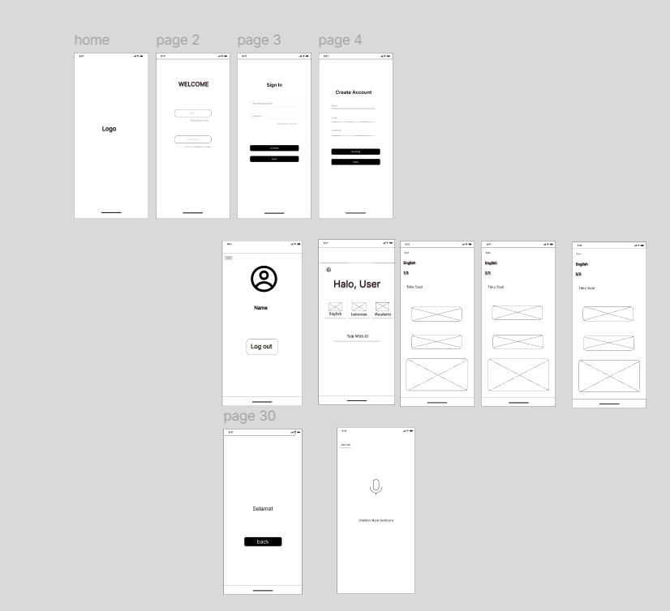.
Pada projek lanjutan ini terjadi perubahan terhadap tata letak dihalaman quiz. Tombol jawaban a dan b di pindah ketengah, lalu dibawahnya ditambahkan kolom untuk fitur penjelasan AI. Di halaman utama teks home diganti menjadi greeting/sapaan kepada user.

## UI/UX
#### 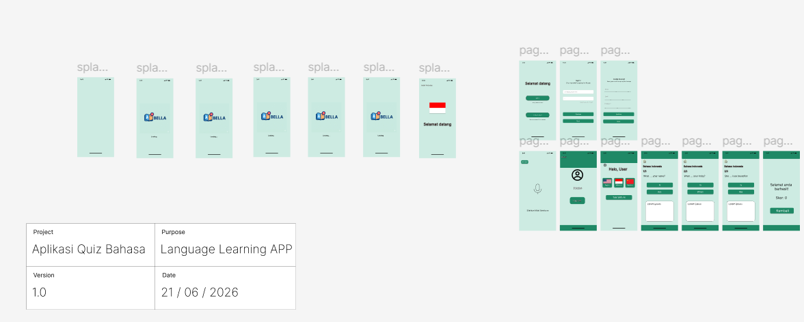.
Pada UI/UX terbaru warna background aplikasi di ubah menjadi warna hijau telur asin. Warna tersebut diubah karena agar tidak terlalu cerah demi kenyamanan user. Saya menambahkan quiz bahasa mandarin pada projek ini. terdapat tambahan 3 fitur AI: fitur AI pembuatan soal otomatis, penjelasan jawban quiz AI, dan latihan bicara bersama AI. Pada halaman berhasil terdapat tambahan skor akhir dari hasil menjawab quiz.

1. Splash Screen
#### 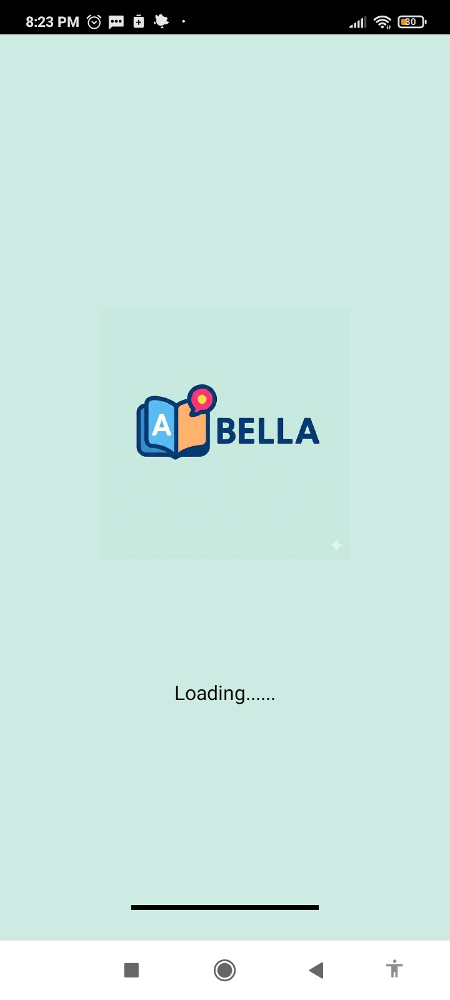.
2. Halaman Lokasi
#### 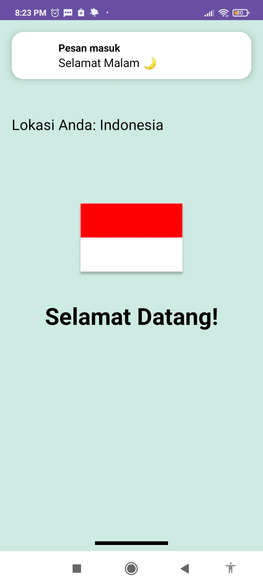.
3. Halaman login
#### 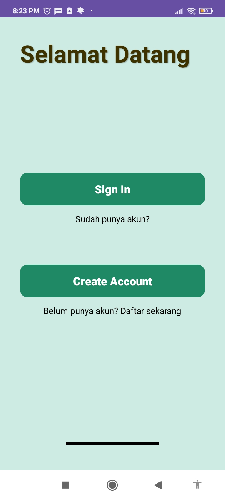.
4. Halaman Sign In
#### 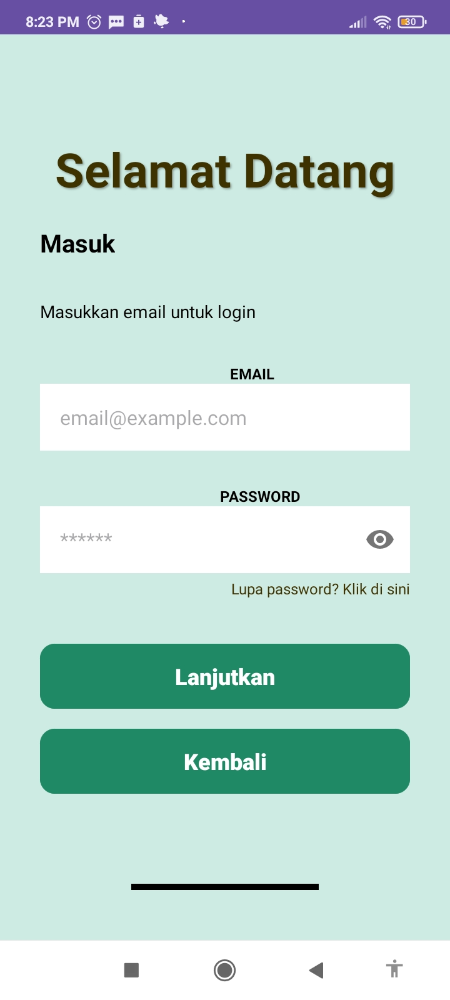.
5. Halaman Create
#### 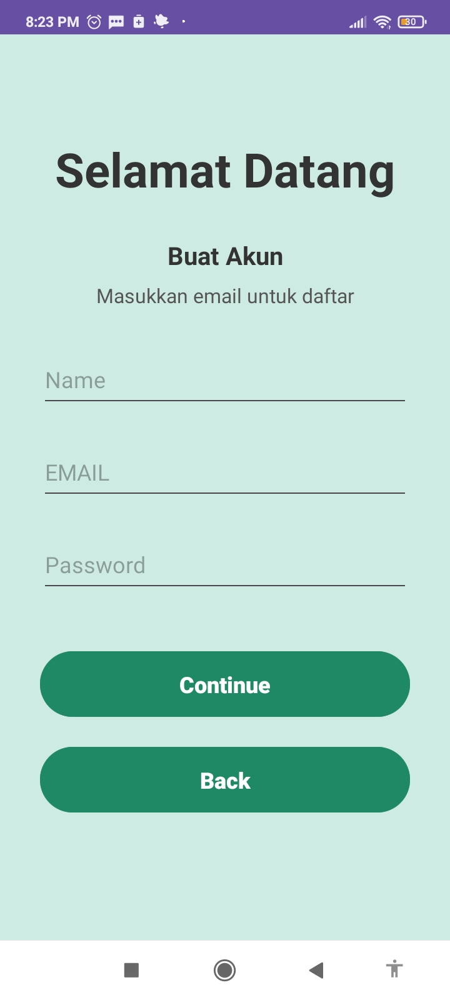.
6. Halaman Home
#### 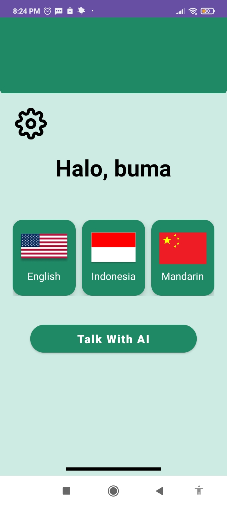.
7. Halaman Profile
#### 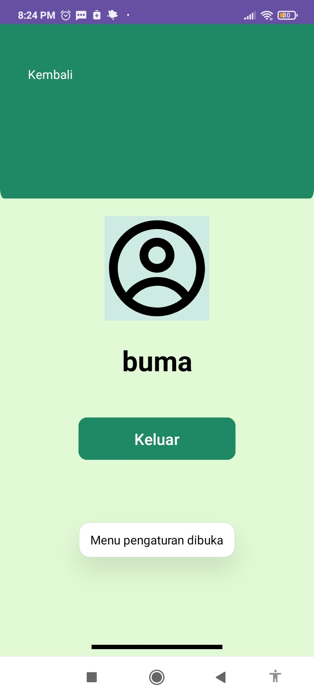.
8. Halaman Quiz 1
#### 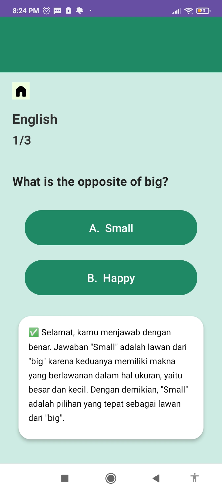.
9. Halaman Quiz 2
#### 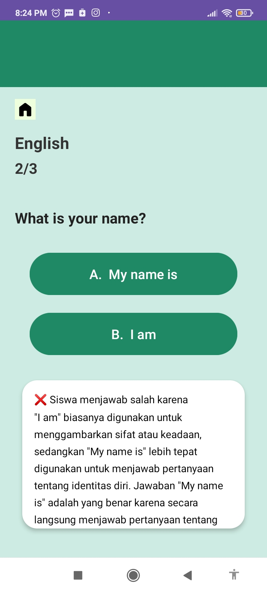.
10. Halaman Quiz 3
#### 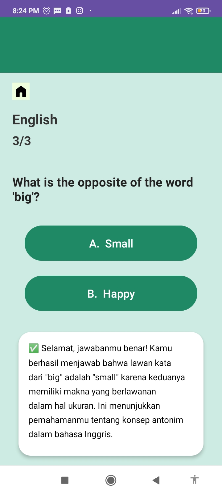.
11. Halaman Skor
#### 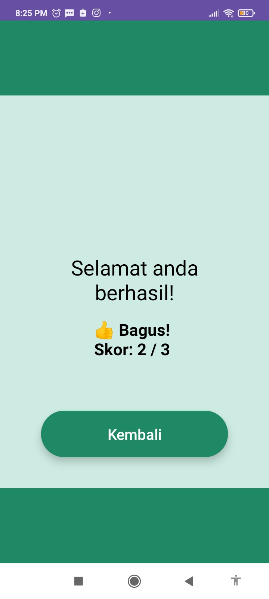.
12. Halaman Talk AI
#### 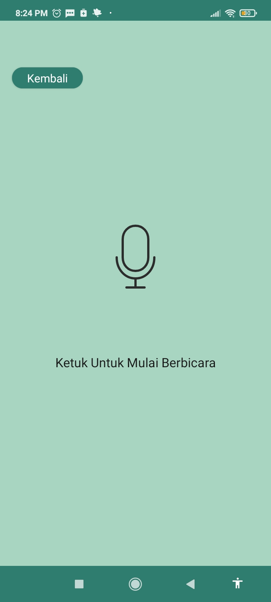.
13. Logo Aplikasi
#### 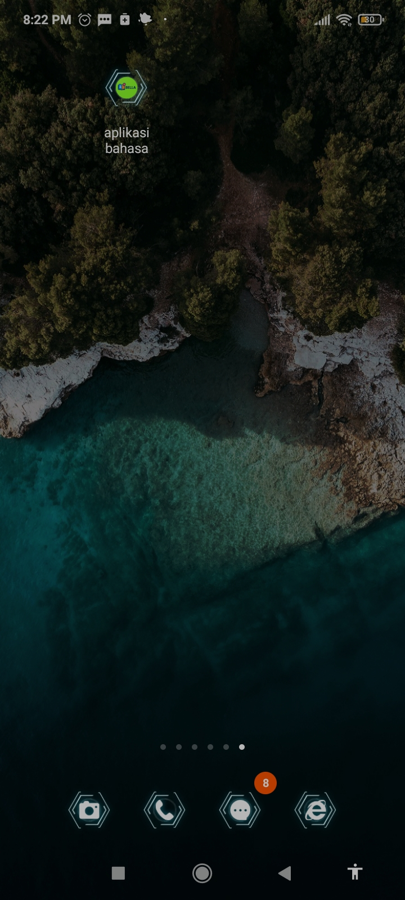.

## Mockup
#### 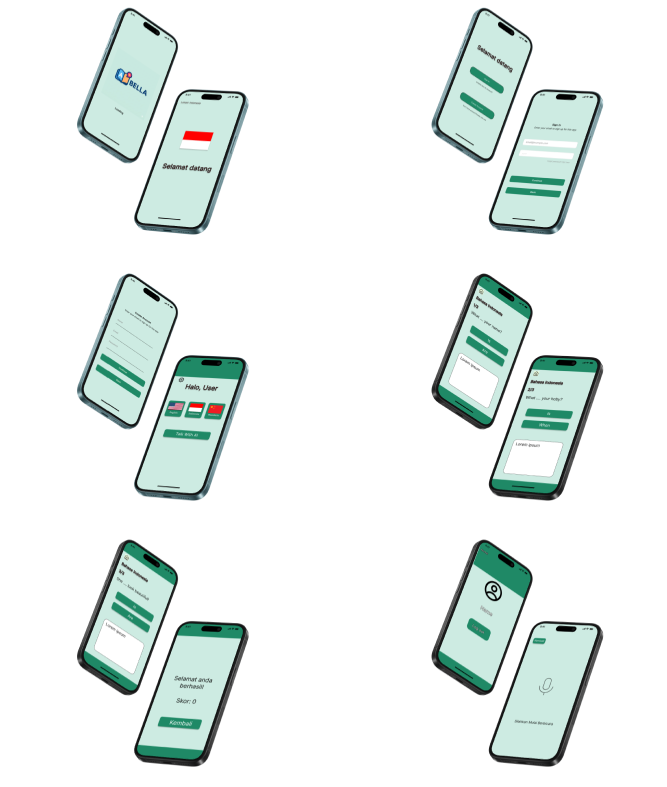.
Mockup untuk tampilan ketika UI/UX telah diterapkan di Mobile, baik di IOS ataupun Android.

## Clikup
#### 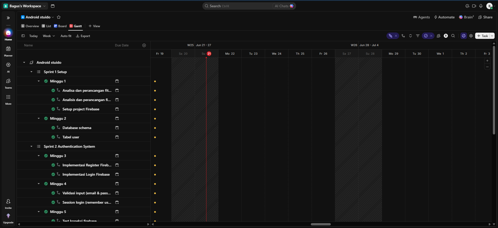.
Tempat untuk membuat jadwal runtutan yang ingin dilakukan dalam membuat projek ini. agar lebih terarut dan rapi dalam mengerjakannya.
berikut adalah link clikup: https://sharing.clickup.com/90181799349/g/h/2kzm23dn-738/e2990ba65e413c9.

## Hasil SCRUM
1. Sprint 1
#### .
2. Sprint 2
#### .
3. Sprint 3
#### .
4. Sprint 4
#### .
5. Sprint 5
#### .
6. Sprint 6
#### .

## Link Youtube
https://youtu.be/tCXDTqFf_S0?si=-jkKGxK6GJipl5Sm.
